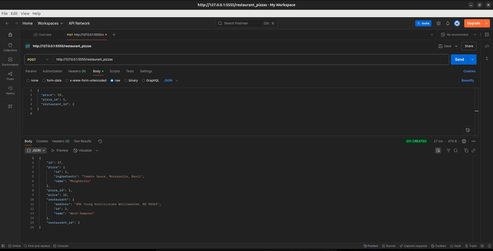

# **Pizza Restaurant Api**


A simple Flask API for managing restaurants,pizzas and the relationship between them.

---

## **Requirements**

For this project, I was required to:

- Create a Flask API backend.
- Define at least three models and their relationships (`Restaurant`, `Pizza`, `RestaurantPizza`).
- Set up migrations and validations.
- Implement the required API routes.

---

## **Setup**

### **Pre-Requisites**

You need the following installed:

- Operating System: **(Windows 10+, Linux 3.8+, or MacOS X 10.7+)**
- Python version: 3.12+
- Pipenv
- Postman account (optional but recommended): [Create Account](https://www.postman.com/)
- RAM: **2GB minimum**, **4GB recommended** (for smoother development)
- Free Disk Space: **1GB minimum**, **2GB recommended**
---

## **Project Structure**

```markdown

.
├── challenge-1-pizzas.postman_collection.json
├── instance
│   └── restaurant.db
├── migrations
│   ├── alembic.ini
│   ├── env.py
│   ├── README
│   ├── script.py.mako
│   └── versions
│       └── 075f57346401_initial_migration.py
├── Pipfile
├── Pipfile.lock
├── README.md
├── screenshots
│   ├── delete.png
│   ├── getp.png
│   ├── getr_id.png
│   ├── getrl_id.png
│   ├── getr.png
│   ├── postf.png
│   ├── postw.png
│   └── relationship.png
└── server
    ├── app.py
    ├── config.py
    ├── controllers
    │   ├── __init__.py
    │   ├── pizza_controller.py
    │   ├── restaurant_controller.py
    │   └── restaurant_pizza_controller.py
    ├── __init__.py
    ├── instance
    ├── models
    │   ├── __init__.py
    │   ├── pizza.py
    │   ├── restaurant_pizza.py
    │   └── restaurant.py
    └── seed.py

```


## **Installation**


1. Clone this repository:
   ```bash
   git clone https://github.com/Richard3wasonga/pizza-api-challenge 
   ```

2. Navigate to the project directory:
   ```bash
   cd recipe-challenge
   ```

3. Install dependices:
   ```bash
   pipenv install
   ```

4. Activate python environment:
   ```bash
   pipenv shell
   ```

5. Run Migrations and Seed Data
   ```bash
   flask db init
   flask db migrate -m "Initial"
   flask db upgrade
   python server/seed.py

   ```

6. Start the server
   ```bash
   python server/app.py
   ```

   open postman and make request to:
   ```bash
   http://127.0.0.1:5555
   ```

---

## **MODEL Deliverables**

### **Relationship**

- A `Restaurant` has many `RestaurantPizzas`

- A `pizza` has many `RestaurantPizzas`

- A `RestaurantPizzas` belongs to a `Restaurant` and a `Pizza`


### **VALIDATIONS Deliverables**

- `RestaurantPizza.price`: must be between **1** and **30**
- Required fileds must be provided when creating `RestaurantPizza`

---

## **API Routes Summary**

| Method | Endpoint                   | Description                         |
|--------|----------------------------|-------------------------------------|
| GET    | `/pizzas`                  | Get all pizzas                      |
| GET    | `/restaurants`             | Get all restaurants                 |
| GET    | `/restaurants/:id`         | Get one restaurant and its pizzas   |
| DELETE | `/restaurants/:id`         | Delete a restaurant                 |
| POST   | `/restaurant_pizzas`       | Create a new restaurant-pizza link  |


## **ROUTES Deliverables**

### **GET/`pizzas`**

Return all available pizzas:

```json

[
  { "id": 1, "name": "Margherita", "ingredients": "Tomato, Basil, Mozzarella" },
  { "id": 2, "name": "Pepperoni", "ingredients": "Tomato, Mozzarella, Pepperoni" }
]

```


### **GET/`restaurants`**

Returns all restaurants:

```json

[
  { "id": 1, "name": "Pizza Planet", "address": "123 Space Rd" },
  { "id": 2, "name": "New York Slices", "address": "Broadway 88" }
]

```


### **GET/`restaurants/:id`**

Return a restaurant all its pizzas:

```json

{
  "id": 1,
  "name": "Pizza Planet",
  "address": "123 Space Rd",
  "pizzas": [
    { "id": 1, "name": "Margherita", "ingredients": "Tomato, Basil, Mozzarella" },
    { "id": 2, "name": "Pepperoni", "ingredients": "Tomato, Mozzarella, Pepperoni" }
  ]
}

```


If `restaurant` id is not found:

```json

{ "error": "Restaurant not found" }

```


### **DELETE/`restaurants/:id`**

Deletes a restaurant and associated restaurant_pizzas.


### **POST/`restaurant_pizzas`**

Create a new `RestaurantPizza` association:

**Request Body:**
```json

{
  "price": 20,
  "pizza_id": 2,
  "restaurant_id": 3
}

```
**Success Response:**

```json

{
    "id": 17,
    "pizza": {
        "id": 1,
        "ingredients": "Tomato Sauce, Mozzarella, Basil",
        "name": "Margherita"
    },
    "pizza_id": 1,
    "price": 15,
    "restaurant": {
        "address": "406 Young Knolls\nLake Williamstad, ND 98365",
        "id": 2,
        "name": "West-Sampson"
    },
    "restaurant_id": 2
}

```



**If validation fails:**

```json

{ "error": "Price must be between 1 and 30" }

```


---

## **Tech Stack**

- Python 3.12

- Flask

- SQLAlchemy

- Flask-Migrate

- Faker(for data seeding)

- SQLite(development DB)

- Postman(testing)


---
## **Authors**
- Richard Wasonga - [GitHub Profile](https://github.com/Richard3wasonga)

## **Contributors**
- Bob Oyier - [GitHub Profile](https://github.com/oyieroyier)

- Titus Ouko - [GitHub Profile](https://github.com/costamay)


## **License**

This project is open-source and available under the MIT License.

